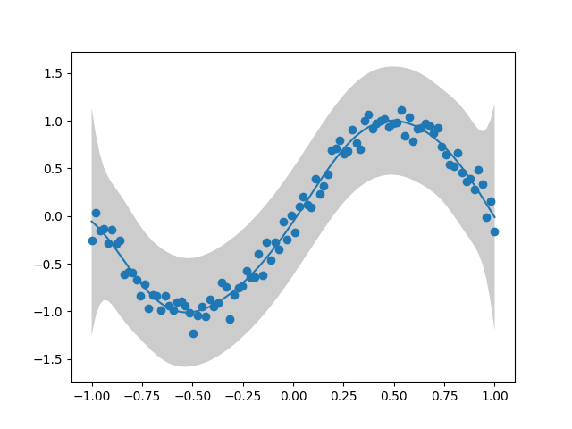

# Generalised Variational Inference for Gaussian Processes

Proposed by <a href="https://arxiv.org/pdf/1904.02063.pdf">Knoblauch et al. (2022)</a>, generalised variational inference (GVI) is a learning framework motivated by an optimisation-centric interpretation of Bayesian inference. 
Extending GVI to infinite dimensions, <a href="https://arxiv.org/pdf/2205.06342.pdf">Wild et al. (2022)</a> introduces Gaussian Wasserstein Inference (GWI) in function spaces. 
GWI demonstrates a new inference approach for variational GPs, circumventing many limitations of previous approaches. Our work introduces various improvements to GWI for GPs, including new kernel parameterisations such as the NNGP kernels from <a href="https://arxiv.org/pdf/1912.02803.pdf">Novak et al. (2019)</a>. 
We also introduce a new learning framework that we call projected GVI (pGVI) for GPs. 
pGVI weakens the GVI assumptions of a definite regulariser. 
Instead, we propose regularising between scalar projections of the stochastic processes, an approach we call projected regularisation. 
We demonstrate that pGVI is a highly flexible and well-performing variational inference framework with significantly cheaper linearly scaling computational costs compared to the cubic costs of existing approaches.
This repository present a comprehensive software implementation of our learning frameworks. 

## Example Visualisations

We demonstrate our approach for a few curve regression tasks:

<p align="middle">
  
  
</p>

For further details for the above visualisations, please see `experiments/toy_curves/`.

## Environment Installation

To set up the repository, please follow the instructions below:

1. Install `poetry`

```shell
pip install poetry
```

2. Install dependencies

```shell
poetry install
```

3. It may be necessary to set the `PYTHONPATH` environment variable to the root of the repository

```shell
export PYTHONPATH=$PWD
```

## Example Usage

The following example demonstrates how to construct an exact GP model.

1. We begin by importing the necessary modules:
```python
import jax
import jax.numpy as jnp
import matplotlib.pyplot as plt

# Import mean, kernel, and GP modules
from src.means import ConstantMean, ConstantMeanParameters
from src.kernels.standard import ARDKernel, ARDKernelParameters
from src.gps import GPRegression, GPRegressionParameters

# Enable 64-bit precision
from jax.config import config
config.update("jax_enable_x64", True)
```

2. We then define the model parameters:
```python
# Construct a zero mean function
mean = ConstantMean()
mean_parameters = ConstantMeanParameters(constant=0)

# Construct an ARD kernel
kernel = ARDKernel(number_of_dimensions=1)
kernel_parameters = ARDKernelParameters(
    log_scaling=jnp.log(10.0),
    log_lengthscales=jnp.log(10.0)
)
```

3. We then construct the exact GP model:
```python
gp = GPRegression(
    mean=mean,
    kernel=kernel,
    x=x,
    y=y
)

# Construct the GP parameters from the mean and kernel parameters
gp_parameters = GPRegressionParameters(
    log_observation_noise=jnp.log(1.0),
    mean=mean_parameters,
    kernel=kernel_parameters,
)
```

4. Generating a sample sine wave dataset:
```python
key = jax.random.PRNGKey(0)
x = jnp.linspace(-1, 1, 100).reshape(-1, 1)
y = jnp.sin(jnp.pi*x)+0.1*jax.random.normal(key, shape=x.shape)
```

5. We can predict the mean and variance of the GP:
```python
prediction = gp.predict_probability(
    parameters=gp_parameters, 
    x=x,
)
```

6. We can visualise the prediction:
```python
plt.plot(x, prediction.mean.reshape(-1), label="mean")
stdev = jnp.sqrt(prediction.covariance)
plt.fill_between(
    x.reshape(-1),
    (prediction.mean - 1.96 * stdev).reshape(-1),
    (prediction.mean + 1.96 * stdev).reshape(-1),
    facecolor=(0.8, 0.8, 0.8),
    label="error bound (95%)",
)
plt.scatter(x, y)
plt.show()
```

