# Gaussian Wasserstein Inference in Function Spaces

Leveraging Generalised Variational Inference (GVI) to build a loss objective with the Wasserstein distance for image classifier sparse Gaussian Processes constructed with NNGP infinite-width kernels.

For a quick overview of GVI, see <a href="https://jswu18.github.io/posts/2023/07/generalised-variational-inference/">my blog post</a>.

Gaussian Wasserstein Inference is developed in <a href="https://arxiv.org/pdf/2205.06342.pdf">this paper</a> by Veit Wild.

To get set up:

1. Install `poetry`

```shell
pip install poetry
```

2. Install dependencies

```shell
poetry install
```

## Sample Regression Curves

### Curve 0
<p align="middle">
  
  
</p>
<p align="middle">
  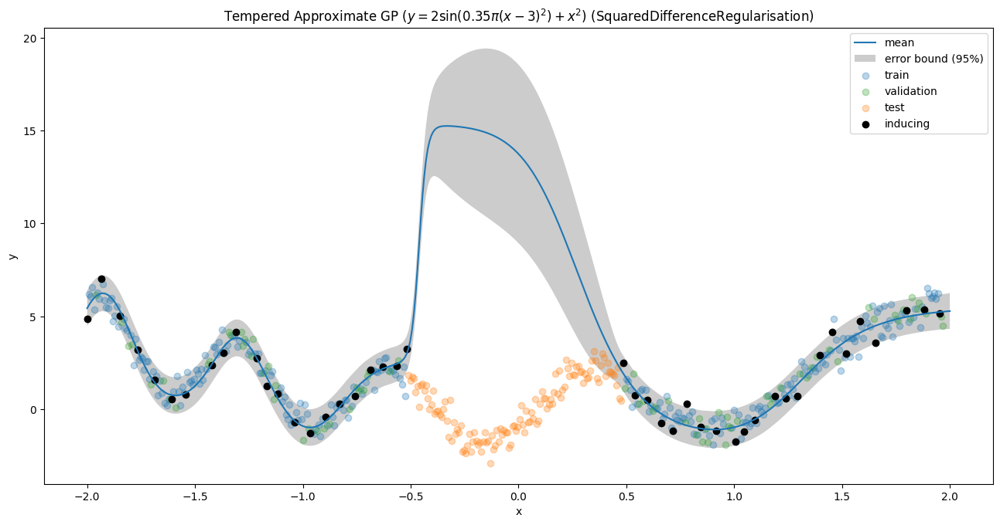
  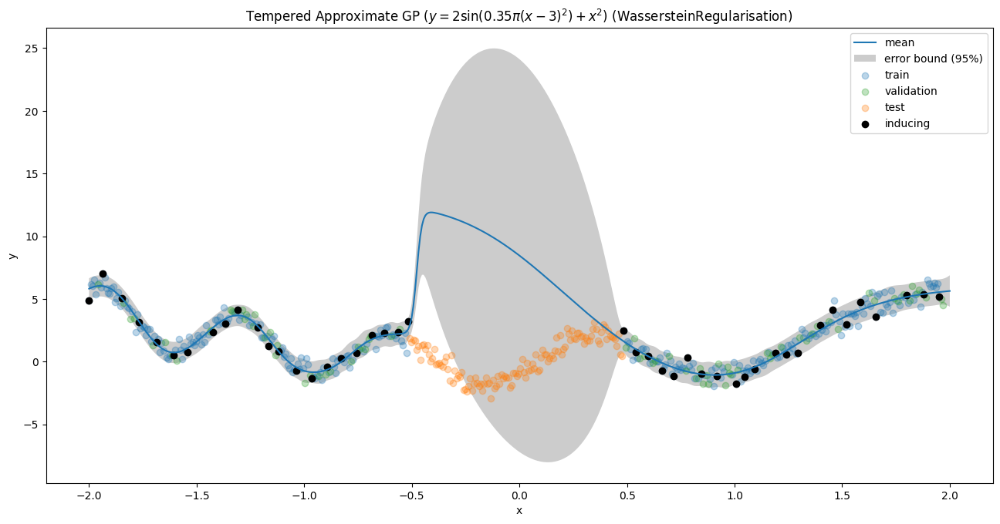
</p>
<p align="middle">
  
</p>

### Curve 1
<p align="middle">
  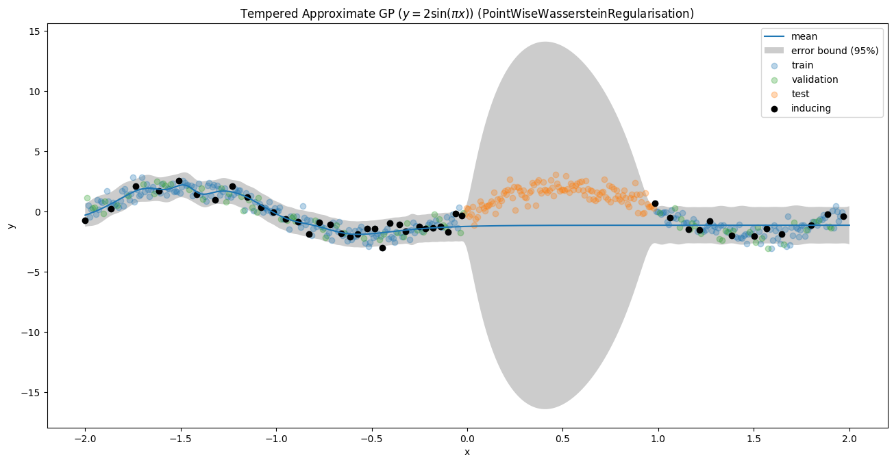
  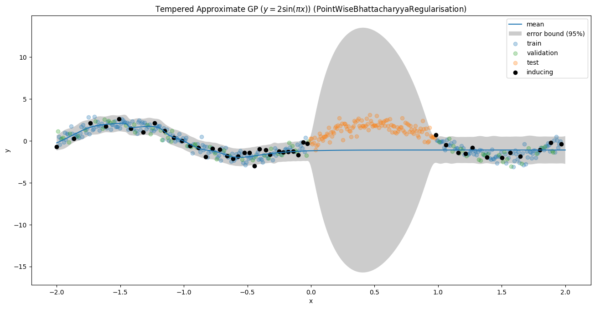
</p>
<p align="middle">
  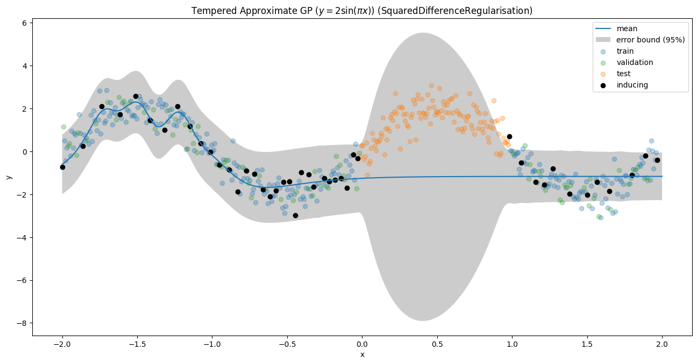
  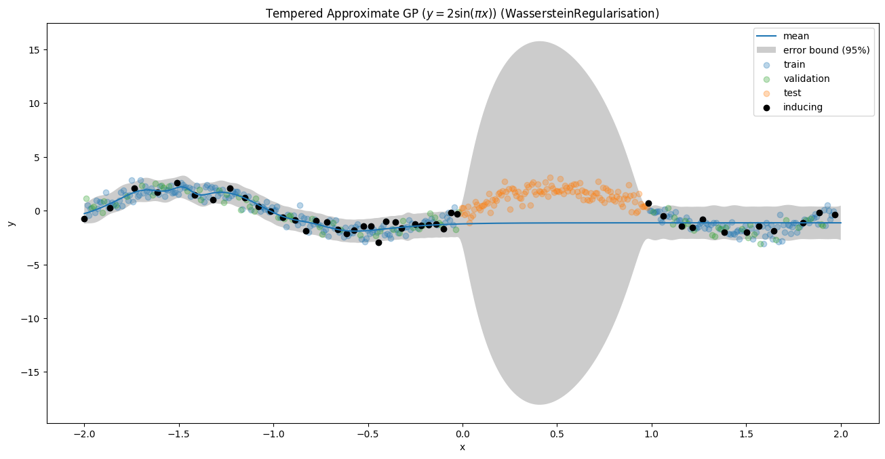
</p>
<p align="middle">
  
</p>

### Curve 2
<p align="middle">
  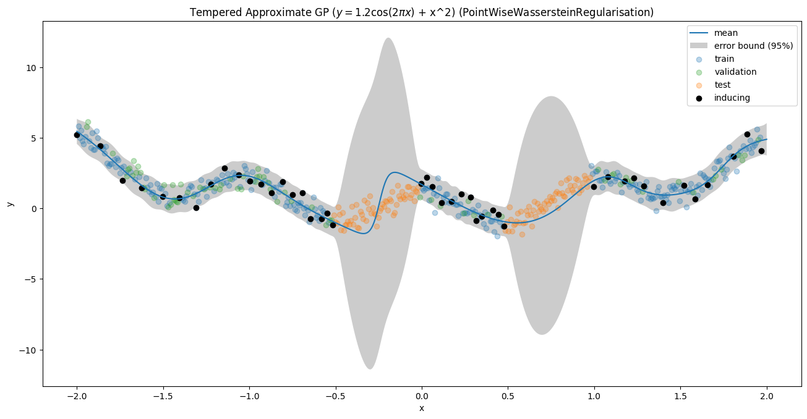
  
</p>
<p align="middle">
  
  
</p>
<p align="middle">
  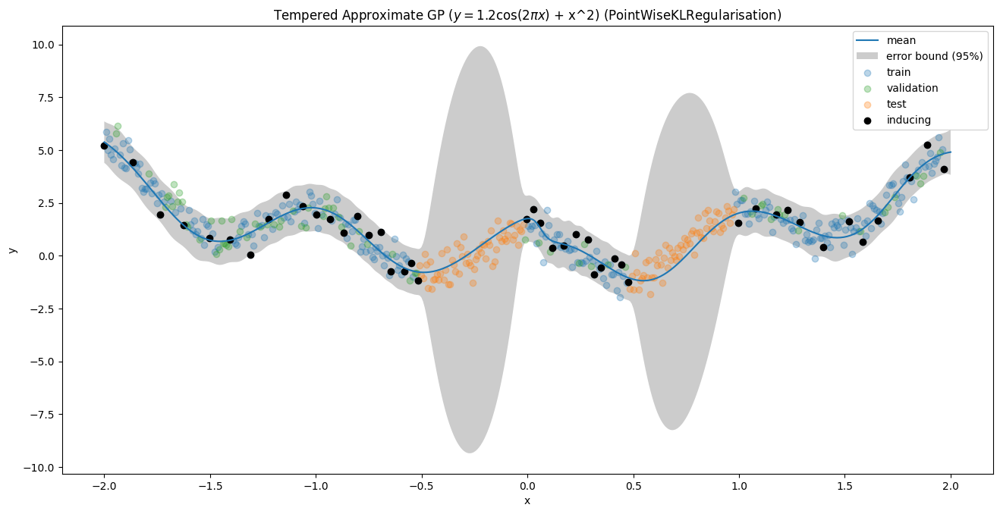
</p>

### Curve 3
<p align="middle">
  
  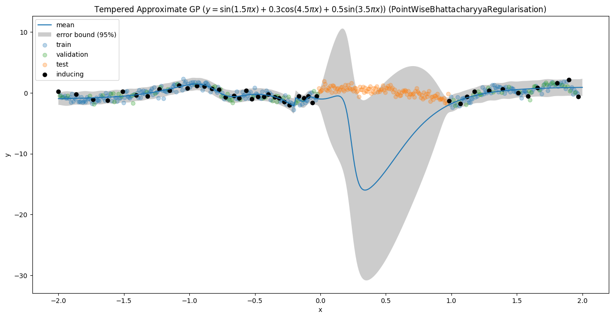
</p>
<p align="middle">
  
  
</p>
<p align="middle">
  
</p>


### Curve 4
<p align="middle">
  
  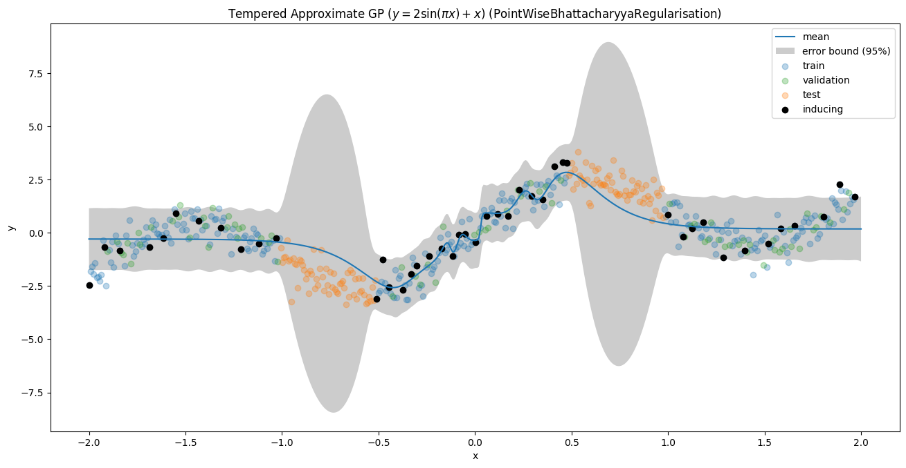
</p>
<p align="middle">
  
  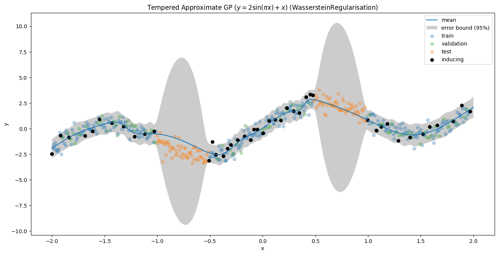
</p>
<p align="middle">
  
</p>

### Curve 5
<p align="middle">
  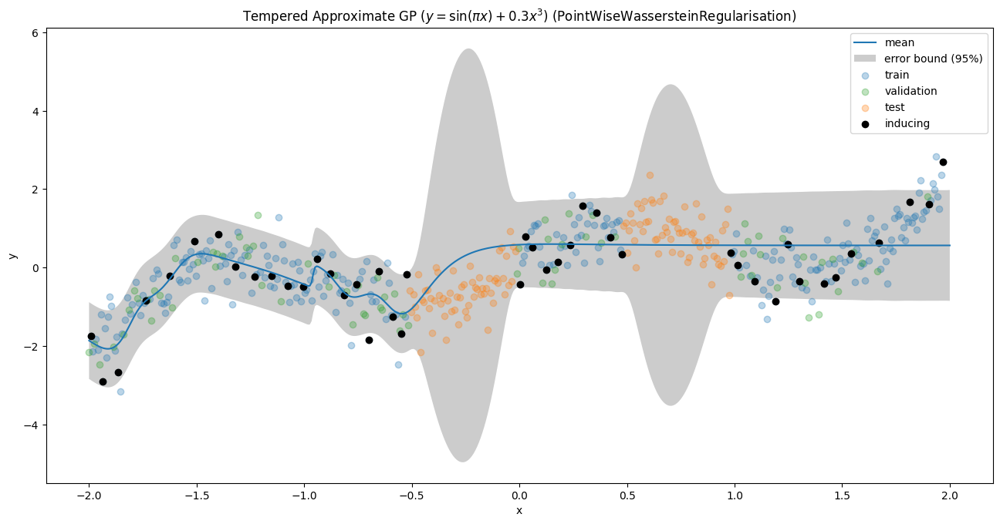
  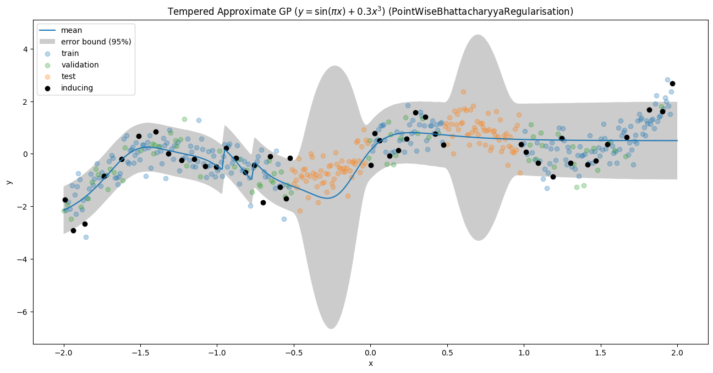
</p>
<p align="middle">
  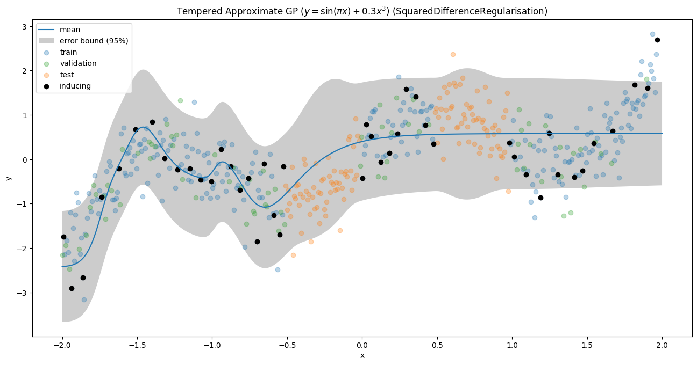
  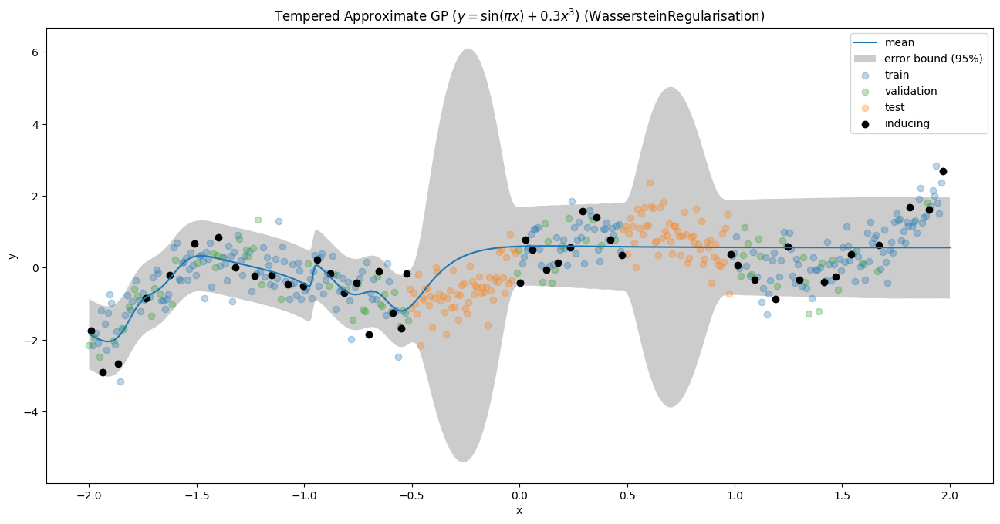
</p>
<p align="middle">
  
</p>

### Curve 6
<p align="middle">
  
  
</p>
<p align="middle">
  
  
</p>
<p align="middle">
  
</p>

### Curve 7
<p align="middle">
  
  
</p>
<p align="middle">
  
  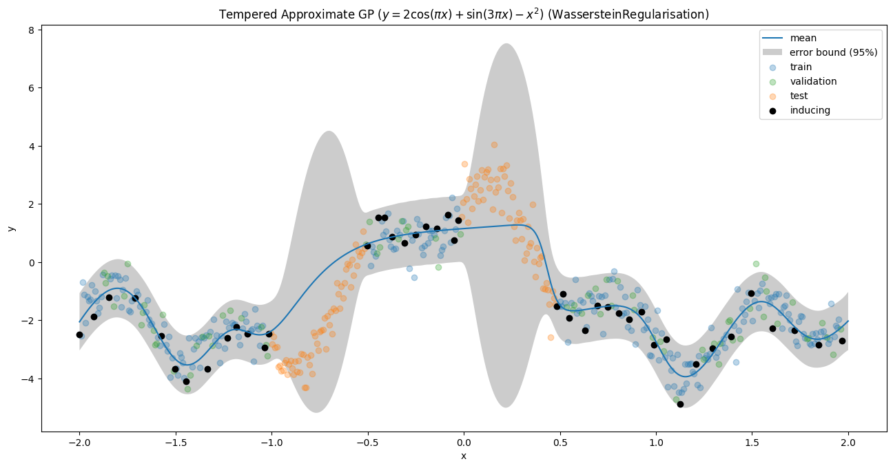
</p>
<p align="middle">
  
</p>

### Curve 8
<p align="middle">
  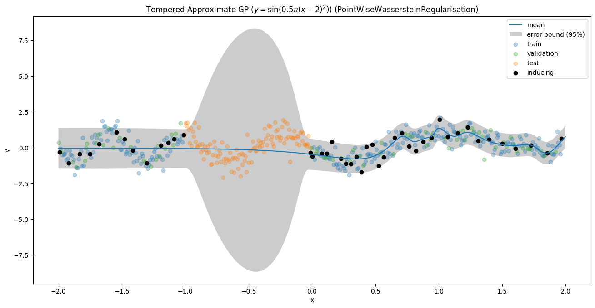
  
</p>
<p align="middle">
  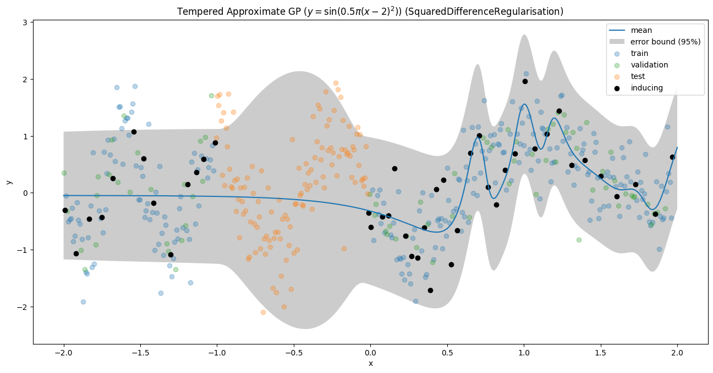
  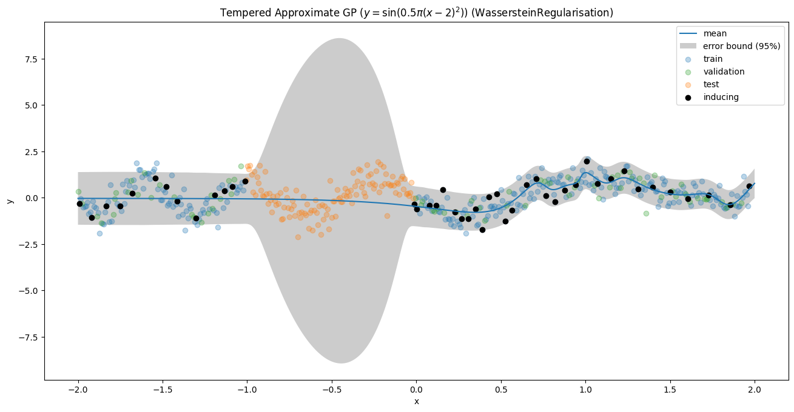
</p>
<p align="middle">
  
</p>

### Curve 9
<p align="middle">
  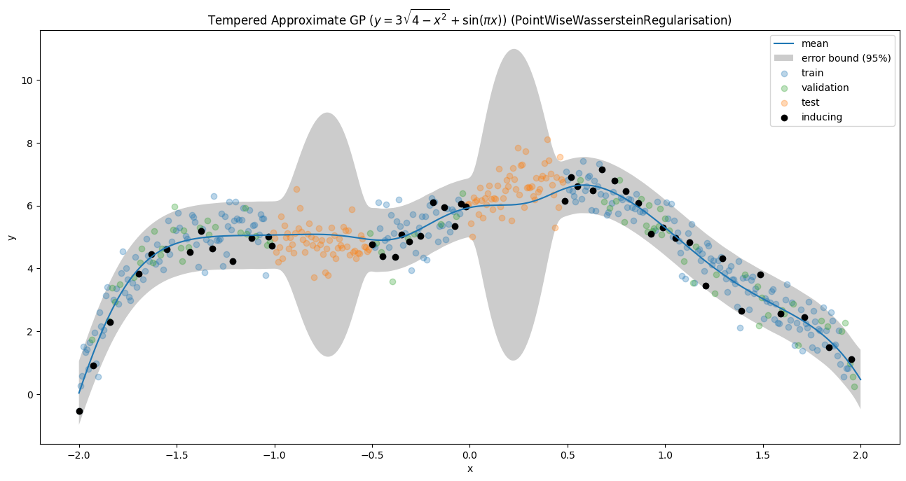
  
</p>
<p align="middle">
  
  
</p>
<p align="middle">
  
</p>