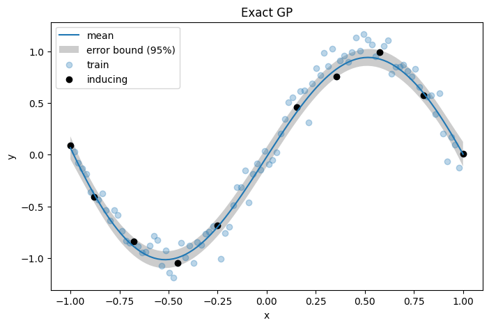
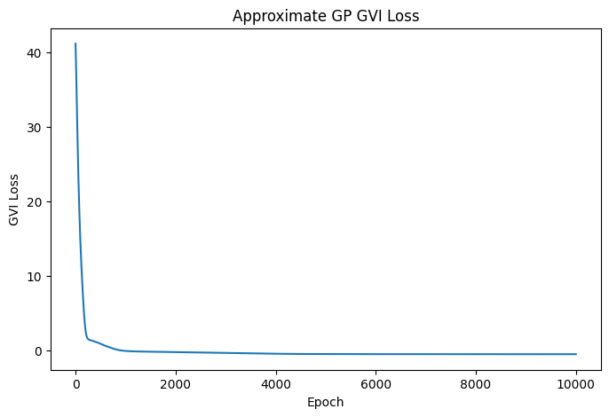
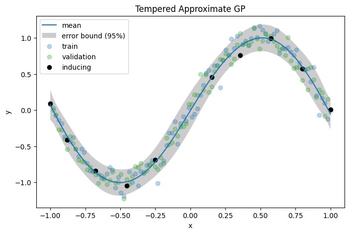

# Generalised Variational Inference for Gaussian Processes

Proposed by <a href="https://arxiv.org/pdf/1904.02063.pdf">Knoblauch et al. (2022)</a>, generalised variational inference (GVI) is a learning framework motivated by an optimisation-centric interpretation of Bayesian inference. 
Extending GVI to infinite dimensions, <a href="https://arxiv.org/pdf/2205.06342.pdf">Wild et al. (2022)</a> introduces Gaussian Wasserstein Inference (GWI) in function spaces. 
GWI demonstrates a new inference approach for variational GPs, circumventing many limitations of previous approaches. Our work introduces various improvements to GWI for GPs, including new kernel parameterisations such as the NNGP kernels from <a href="https://arxiv.org/pdf/1912.02803.pdf">Novak et al. (2019)</a>. 
We also introduce a new learning framework that we call projected GVI (pGVI) for GPs. 
pGVI weakens the GVI assumptions of a definite regulariser. 
Instead, we propose regularising between scalar projections of the stochastic processes, an approach we call projected regularisation. 
We demonstrate that pGVI is a highly flexible and well-performing variational inference framework with significantly cheaper linearly scaling computational costs compared to the cubic costs of existing approaches.
This repository present a comprehensive software implementation of our learning frameworks. 

Below are visualisations from our regression experiments in`experiments/toy_curves/`
<p align="middle">
  
  
</p>

## Environment Installation

To set up the Python environment for this project, please follow the instructions below:

1. Install `poetry`

```shell
pip install poetry
```

2. Install dependencies

```shell
poetry install
```

3. It may be necessary to set the `PYTHONPATH` environment variable to the root of the repository

```shell
export PYTHONPATH=$PWD
```

## Example Usage

This section demonstrates an example usage of our codebase.
We will go through a full GVI training example for a GP regression task.
This will involve the following steps:
1. inducing points selection, 
2. training an exact GP, 
3. training an approximate GP, and 
4. tempering the approximate GP.

We begin by importing some necessary modules:
```python
import jax
import jax.numpy as jnp
import matplotlib.pyplot as plt

from jax.config import config

# Enable 64 bit
config.update("jax_enable_x64", True)
```

For our example, we will generate some noisy data following a sine function:
```python
number_of_points = 100
noise = 0.1
key = jax.random.PRNGKey(0)

# Generate data with noise
key, subkey = jax.random.split(key)
x = jnp.linspace(-1, 1, number_of_points).reshape(-1, 1)
y = jnp.sin(jnp.pi * x) + noise * jax.random.normal(subkey, shape=x.shape)

fig, ax = plt.subplots(figsize=(8, 5))
ax.scatter(x, y, label="train", alpha=0.3, color="tab:blue")
ax.set_xlabel("x")
ax.set_ylabel("y")
ax.set_title("Train Data")
ax.legend()
fig.savefig("train_data.png", bbox_inches="tight")
plt.show()
```


We will now construct an ARD kernel for inducing points selection:
```python
from src.kernels.standard import ARDKernel

kernel = ARDKernel(number_of_dimensions=1)
kernel_parameters = kernel.Parameters.construct(
    log_scaling=jnp.log(10.0), log_lengthscales=jnp.log(10.0)
)
```

We select the inducing points using the greedy conditional variance method:
```python
from src.inducing_points_selection import ConditionalVarianceInducingPointsSelector

key, subkey = jax.random.split(key)
inducing_points_selector = ConditionalVarianceInducingPointsSelector()
(
    inducing_points,
    inducing_points_indices,
) = inducing_points_selector.compute_inducing_points(
    key=subkey,
    training_inputs=x,
    number_of_inducing_points=int(jnp.sqrt(number_of_points)),
    kernel=kernel,
    kernel_parameters=kernel_parameters,
)
inducing_points_responses = y[inducing_points_indices]

fig, ax = plt.subplots(figsize=(8, 5))
ax.scatter(x, y, label="train", alpha=0.3, color="tab:blue")
ax.scatter(inducing_points, inducing_points_responses, label="inducing", color="black")
ax.set_xlabel("x")
ax.set_ylabel("y")
ax.set_title("Inducing Points Selection")
ax.legend()
fig.savefig("inducing_data.png", bbox_inches="tight")
plt.show()
```


We will now construct an exact GP parameterised by a zero mean function and the ARD kernel from before:
```python
from src.means import ConstantMean
from src.gps import GPRegression

# Construct mean
mean = ConstantMean()
mean_parameters = mean.Parameters.construct(constant=0.0)

# Construct exact GP
exact_gp = GPRegression(
    mean=mean,
    kernel=kernel,
    x=inducing_points,
    y=inducing_points_responses,
)
exact_gp_parameters = exact_gp.Parameters.construct(
    log_observation_noise=jnp.log(1.0),
    mean=mean_parameters,
    kernel=kernel_parameters,
)
```

To train the exact GP, we will use the negative log likelihood as the empirical risk:
```python
from src.empirical_risks import NegativeLogLikelihood

empirical_risk = NegativeLogLikelihood(gp=exact_gp)
```

We train the exact GP using Optax:
```python
import optax

empirical_risk_loss = [
    empirical_risk.calculate_empirical_risk(
        exact_gp_parameters,
        inducing_points,
        inducing_points_responses,
    )
]

optimiser = optax.adabelief(learning_rate=1e-3)
opt_state = optimiser.init(exact_gp_parameters.dict())
for _ in range(1000):
    gradients = jax.grad(
        lambda exact_gp_parameters_dict: empirical_risk.calculate_empirical_risk(
            exact_gp_parameters_dict,
            inducing_points,
            inducing_points_responses,
        )
    )(exact_gp_parameters.dict())
    updates, opt_state = optimiser.update(gradients, opt_state)
    exact_gp_parameters = exact_gp_parameters.construct(
        **optax.apply_updates(exact_gp_parameters.dict(), updates)
    )
    empirical_risk_loss.append(
        empirical_risk.calculate_empirical_risk(
            exact_gp_parameters,
            inducing_points,
            inducing_points_responses,
        )
    )

fig, ax = plt.subplots(figsize=(8, 5))
plt.plot(empirical_risk_loss)
ax.set_xlabel("Epoch")
ax.set_ylabel("NLL")
ax.set_title("Exact GP NLL")
fig.savefig("exact_gp_nll.png", bbox_inches="tight")
plt.show()
```


Visualising the predictions of the exact GP:
```python
prediction = exact_gp.predict_probability(
    parameters=exact_gp_parameters,
    x=x,
)

fig, ax = plt.subplots(figsize=(8, 5))
ax.plot(x, prediction.mean.reshape(-1), label="mean")
stdev = jnp.sqrt(prediction.covariance)
ax.fill_between(
    x.reshape(-1),
    (prediction.mean - 1.96 * stdev).reshape(-1),
    (prediction.mean + 1.96 * stdev).reshape(-1),
    facecolor=(0.8, 0.8, 0.8),
    label="error bound (95%)",
)
ax.scatter(x, y, label="train", alpha=0.3, color="tab:blue")
ax.scatter(inducing_points, inducing_points_responses, label="inducing", color="black")
ax.set_xlabel("x")
ax.set_ylabel("y")
ax.set_title("Exact GP")
ax.legend()
plt.savefig("exact_gp.png")
plt.show()
```


Now we are ready to train the approximate GP. 
We start by constructing a fully connected neural network, which we will use for our approximate mean:
```python
import flax.linen as nn


class FullyConnectedNeuralNetwork(nn.Module):
    @nn.compact
    def __call__(self, x):
        x = nn.Dense(
            features=10,
        )(x)
        x = nn.tanh(x)
        x = nn.Dense(
            features=1,
        )(x)
        return x


fcnn = FullyConnectedNeuralNetwork()

# Randomly initialise parameters
key, subkey = jax.random.split(key)
fcnn_parameters = fcnn.init(
    subkey,
    jnp.empty(1),
)
```

We now instantiate a custom mean function, which will be constructed with our neural network:
```python
from src.means import CustomMean

approximate_mean = CustomMean(
    mean_function=lambda parameters, x: fcnn.apply(parameters, x)
)
approximate_mean_parameters = approximate_mean.Parameters.construct(
    custom=fcnn_parameters
)
```

For this example, we construct our approximate kernel with the sparse posterior kernel:
```python
from src.kernels.approximate import SparsePosteriorKernel

approximate_kernel = SparsePosteriorKernel(
    base_kernel=kernel,
    inducing_points=inducing_points,
)
approximate_kernel_parameters = approximate_kernel.Parameters.construct(
    base_kernel=kernel_parameters
)
```

We now instantiate our approximate GP:
```python
from src.gps import ApproximateGPRegression

approximate_gp = ApproximateGPRegression(
    mean=approximate_mean,
    kernel=approximate_kernel,
)
approximate_gp_parameters = approximate_gp.Parameters.construct(
    mean=approximate_mean_parameters,
    kernel=approximate_kernel_parameters,
)
```

The GVI objective is constructed with an empirical risk and a regularisation term.
We will use the negative log likelihood as the empirical risk and regularise with the projected Renyi divergence: 
```python
from src.regularisations.projected import ProjectedRenyiRegularisation
from src.generalised_variational_inference import GeneralisedVariationalInference

gvi_empirical_risk = NegativeLogLikelihood(gp=approximate_gp)
gvi_regularisation = ProjectedRenyiRegularisation(
    gp=approximate_gp,
    regulariser=exact_gp,
    regulariser_parameters=exact_gp_parameters,
    mode="posterior",
    alpha=0.5,
)
gvi = GeneralisedVariationalInference(
    empirical_risk=gvi_empirical_risk,
    regularisation=gvi_regularisation,
)
```

Now we can train our approximate GP with Optax using the GVI objective:
```python
optimiser = optax.adabelief(learning_rate=1e-3)
opt_state = optimiser.init(approximate_gp_parameters.dict())
gvi_loss = [
    gvi.calculate_loss(
        approximate_gp_parameters,
        x,
        y,
    )
]
for _ in range(10000):
    gradients = jax.grad(
        lambda approximate_gp_parameters_dict: gvi.calculate_loss(
            approximate_gp_parameters_dict,
            x,
            y,
        )
    )(approximate_gp_parameters.dict())
    updates, opt_state = optimiser.update(gradients, opt_state)
    approximate_gp_parameters = approximate_gp_parameters.construct(
        **optax.apply_updates(approximate_gp_parameters.dict(), updates)
    )
    gvi_loss.append(
        gvi.calculate_loss(
            approximate_gp_parameters,
            x,
            y,
        )
    )

fig, ax = plt.subplots(figsize=(8, 5))
plt.plot(gvi_loss)
ax.set_xlabel("Epoch")
ax.set_ylabel("GVI Loss")
ax.set_title("Approximate GP GVI Loss")
fig.savefig("approximate_gp_gvi_loss.png", bbox_inches="tight")
plt.show()
```


We can now plot the approximate GP prediction:
```python
prediction = approximate_gp.predict_probability(
    parameters=approximate_gp_parameters,
    x=x,
)

fig, ax = plt.subplots(figsize=(8, 5))
ax.plot(x, prediction.mean.reshape(-1), label="mean")
stdev = jnp.sqrt(prediction.covariance)
ax.fill_between(
    x.reshape(-1),
    (prediction.mean - 1.96 * stdev).reshape(-1),
    (prediction.mean + 1.96 * stdev).reshape(-1),
    facecolor=(0.8, 0.8, 0.8),
    label="error bound (95%)",
)
ax.scatter(x, y, label="train", alpha=0.3, color="tab:blue")
ax.scatter(inducing_points, inducing_points_responses, label="inducing", color="black")
ax.set_xlabel("x")
ax.set_ylabel("y")
ax.set_title("Approximate GP")
ax.legend()
plt.savefig("approximate_gp.png")
plt.show()
```


In practice, the approximate GP would be tempered with a held-out validation set.
For the purposes of this example, we generate some new data:

```python
key, subkey = jax.random.split(key)
x_temper = jnp.linspace(-1, 1, 100).reshape(-1, 1)
y_temper = jnp.sin(jnp.pi * x_temper) + noise * jax.random.normal(
    subkey, shape=x_temper.shape
)
```

We construct a tempered kernel:
```python
from src.kernels import TemperedKernel

tempered_kernel = TemperedKernel(
    base_kernel=approximate_gp.kernel,
    base_kernel_parameters=approximate_kernel_parameters.construct(
        **approximate_gp_parameters.kernel
    ),
    number_output_dimensions=1,
)
tempered_kernel_parameters = tempered_kernel.Parameters.construct(
    log_tempering_factor=jnp.log(1.0)
)
```

We now instantiate our tempered GP using the tempered kernel and the approximate GP mean from before:
```python
tempered_gp = ApproximateGPRegression(
    mean=approximate_gp.mean,
    kernel=tempered_kernel,
)
tempered_gp_parameters = tempered_gp.Parameters.construct(
    mean=approximate_gp_parameters.mean,
    kernel=tempered_kernel_parameters,
)
```

We can now train our tempered GP using the negative log likelihood as the empirical risk. 
We will use Optax to optimise the tempered kernel parameters:
```python
tempered_empirical_risk = NegativeLogLikelihood(gp=tempered_gp)

tempered_empirical_risk_loss = [
    tempered_empirical_risk.calculate_empirical_risk(
        tempered_gp_parameters,
        x_temper,
        y_temper,
    )
]
optimiser = optax.adabelief(learning_rate=1e-3)

# Initialise optimiser with tempered kernel parameters
opt_state = optimiser.init(tempered_kernel_parameters.dict())
for _ in range(1000):
    gradients = jax.grad(
        lambda tempered_kernel_parameters_dict: tempered_empirical_risk.calculate_empirical_risk(
            tempered_gp.Parameters.construct(
                log_observation_noise=approximate_gp_parameters.log_observation_noise,
                mean=approximate_gp_parameters.mean,
                kernel=tempered_kernel_parameters_dict,
            ),
            x_temper,
            y_temper,
        )
    )(tempered_kernel_parameters.dict())
    updates, opt_state = optimiser.update(gradients, opt_state)
    tempered_kernel_parameters = tempered_kernel_parameters.construct(
        **optax.apply_updates(tempered_kernel_parameters.dict(), updates)
    )
    tempered_gp_parameters = tempered_gp.Parameters.construct(
        log_observation_noise=approximate_gp_parameters.log_observation_noise,
        mean=approximate_gp_parameters.mean,
        kernel=tempered_kernel_parameters,
    )
    tempered_empirical_risk_loss.append(
        tempered_empirical_risk.calculate_empirical_risk(
            tempered_gp_parameters,
            x_temper,
            y_temper,
        )
    )

fig, ax = plt.subplots(figsize=(8, 5))
plt.plot(tempered_empirical_risk_loss)
ax.set_xlabel("Epoch")
ax.set_ylabel("NLL")
ax.set_title("Tempered Approximate GP NLL")
fig.savefig("tempered_approximate_gp_nll.png", bbox_inches="tight")
plt.show()
```


Plotting the tempered GP prediction, we have now completed a full example of GVI for GPs!
```python
prediction = tempered_gp.predict_probability(
    parameters=tempered_gp_parameters,
    x=x,
)

fig, ax = plt.subplots(figsize=(8, 5))
ax.plot(x, prediction.mean.reshape(-1), label="mean")
stdev = jnp.sqrt(prediction.covariance)
ax.fill_between(
    x.reshape(-1),
    (prediction.mean - 1.96 * stdev).reshape(-1),
    (prediction.mean + 1.96 * stdev).reshape(-1),
    facecolor=(0.8, 0.8, 0.8),
    label="error bound (95%)",
)
ax.scatter(x, y, label="train", alpha=0.3, color="tab:blue")
ax.scatter(
    x_temper,
    y_temper,
    label="validation",
    alpha=0.3,
    color="tab:green",
)
ax.scatter(inducing_points, inducing_points_responses, label="inducing", color="black")
ax.set_xlabel("x")
ax.set_ylabel("y")
ax.set_title("Tempered Approximate GP")
ax.legend()
plt.savefig("tempered_gp.png")
plt.show()
```
