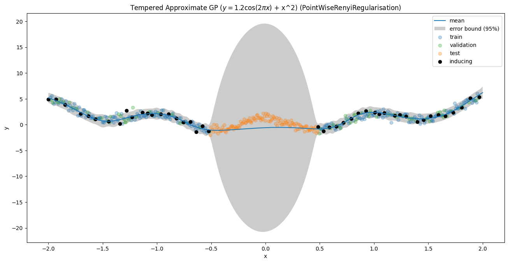

# Generalised Variational Inference for Sparse Gaussian Process Learning

Leveraging Generalised Variational Inference (GVI) to construct loss objectives for sparse Gaussian Process (sGP) learning in the contexts of both regression and classification. This is a flexible framework accommodating any regulariser and any empirical risk. Regularisers are defined with respect to a distance metric for push-forward Gaussian measures in function spaces (i.e. the Wasserstein Metric on Hilbert Spaces). With GVI we are much more flexible in our sGP construction than traditional methods.  For a quick overview of GVI, see my <a href="https://jswu18.github.io/posts/2023/07/generalised-variational-inference/">blog post</a>. Gaussian Wasserstein Inference (GVI with the Wasserstein metric as the regulariser) is developed in <a href="https://arxiv.org/pdf/2205.06342.pdf">this paper</a> by Veit Wild.

To get set up:

1. Install `poetry`

```shell
pip install poetry
```

2. Install dependencies

```shell
poetry install
```

## Sample Regression Curves
These are some regression curves showing GVI in action. Sparse GPs are trained on the curves with different regularisers.

### Curve 0
<p align="middle">
  
</p>

### Curve 1
<p align="middle">
  
</p>

### Curve 2
<p align="middle">
  
</p>

### Curve 3
<p align="middle">
  
</p>

### Curve 4
<p align="middle">
  
</p>

### Curve 5
<p align="middle">
  
</p>

### Curve 6
<p align="middle">
  
</p>

### Curve 7
<p align="middle">
  
</p>

### Curve 8
<p align="middle">
  
</p>

### Curve 9
<p align="middle">
  
</p>
