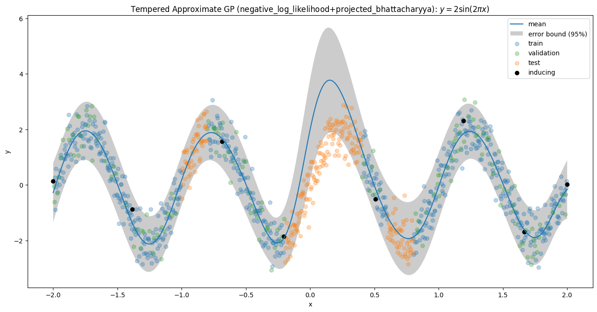
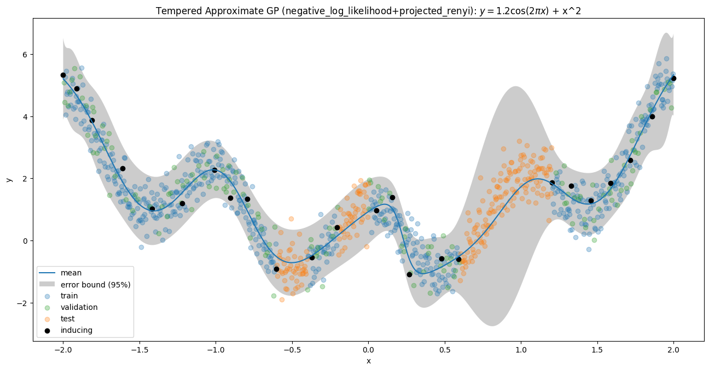
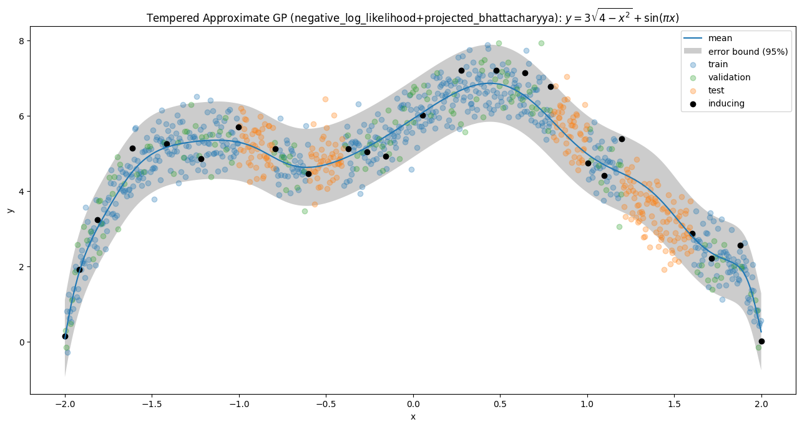

# Regression Curve Experiments

To demonstrate our experimentation framework, we trained approximate GPs for ten different regression curve problems. 
Randomly selected segments of each curve were removed from the training data to simulate an out-of-distribution (OOD) setting.

## Reproducing the Experiments

Using our framework, we constructed 1260 combinations of experiment settings, each defined through .yaml configuration files. 
Each setting includes a unique combination of constructions for the regulariser GP, the approximate GP, and the GVI objective, among other parameters.
The lists of options for each section that we explored are outlined in `base_configs/`.

To reproduce our experiments, run the following from the repository root:

1. Generate the experiment configurations.

```shell
python experiments/generate_configs.py --problem toy_curves
```

2. Generate shell scripts for experiments.

```shell
python experiments/generate_shell_commands.py --problem toy_curves 
```

3. (Optional) Generate shell scripts for job submission to the Myriad cluster.

```shell
python experiments/generate_myriad_commands.py --problem toy_curves 
```

4. (Optional) If running on Myriad, run the automatically generated shell commands. Only submit each set of jobs after the previous set has completed.
```shell
./toy_curves-build_data.sh
./toy_curves-train_regulariser.sh
./toy_curves-train_approximate.sh
./toy_curves-temper_approximate.sh
```

## Best Performing Approximate GPs 

After running all 1260 combinations, we selected the experiment having the best validation set negative log-likelihood.
Our framework is quite successful at learning the training data for all the curve examples. 
With the exception of Curve 4, they also demonstrate reasonable behaviours in the OOD setting

<p align="middle">
  
  
</p>

<p align="middle">
  
  
</p>

<p align="middle">
  
  
</p>

<p align="middle">
  
  
</p>

<p align="middle">
  
  
</p>

